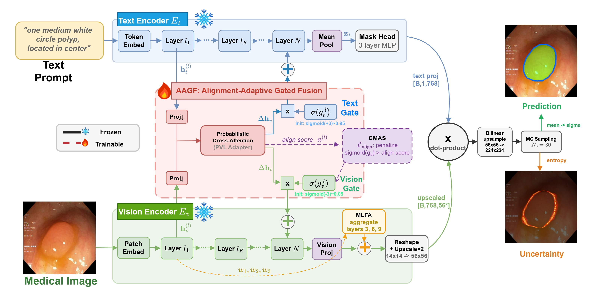

# Fusion Direction Matters: Alignment-Adaptive Cross-Modal Fusion for Medical Image Segmentation

Official implementation for **AdaPVL**: Alignment-Adaptive Probabilistic
Vision-Language Fusion for medical image segmentation.

AdaPVL extends MedCLIPSeg with adaptive fusion direction control across multiple
vision-language backbone pairs. The key idea is that fusion direction should
depend on the alignment status of the image and text encoders: pre-aligned
encoder pairs can benefit from bidirectional interaction, while non-aligned
pairs often require text-side adaptation that preserves image spatial structure.

## Architecture



## Highlights

1. **Alignment-Adaptive Gated Fusion (AAGF)** learns per-layer directional gates
   for image-to-text and text-to-image information flow.
2. **Multi-Layer Feature Aggregation (MLFA)** collects fusion-stage features for
   stronger dense prediction.
3. **Backbone coverage** includes EVA-CLIP, SigLIP, UniMedCLIP, DINOv2, DINOv3,
   and DINOv3+SigLIP variants.
4. **MedCLIPSeg compatibility** keeps the original training and evaluation
   pipeline while adding AdaPVL model builders.

## Repository Layout

```text
configs/          Dataset and experiment configs
datasets/         Segmentation dataloaders and transforms
trainers/         MedCLIPSeg and AdaPVL model definitions
utils/            Evaluation, config, and weight-resolution helpers
scripts/          Training, evaluation, ablation, and visualization scripts
train.py          Training entry point
test.py           Evaluation entry point
```

Large datasets, checkpoints, pretrained backbone weights, cached model files,
paper drafts, and local experiment outputs are intentionally not included.

## Installation

```bash
conda create -n adapvl python=3.10
conda activate adapvl
pip install -r requirements.txt
```

Prepare pretrained backbones locally under `weights/` or configure the paths
used by `utils/weights.py`. Dataset folders should follow the paths specified in
the YAML files under `configs/`.

## Training

Single-run example:

```bash
python train.py \
  --config-file configs/Kvasir.yaml \
  --output-dir output_adapvl \
  --data_percentage 10 \
  MODEL.CLIP_MODEL adapvl_evaclip
```

Batch experiment runner:

```bash
bash scripts/run_adapvl.sh output_adapvl 1
```

## Evaluation

```bash
python test.py \
  --config-file configs/Kvasir.yaml \
  --output-dir output_adapvl \
  --source_dataset Kvasir_10 \
  --data_percentage 10 \
  --prompt_design original \
  MODEL.CLIP_MODEL adapvl_evaclip
```

## Citation

```bibtex
@inproceedings{adapvl2026,
  title     = {Fusion Direction Matters: Alignment-Adaptive Cross-Modal Fusion for Medical Image Segmentation},
  booktitle = {International Conference on Intelligent Computing (ICIC)},
  year      = {2026},
  note      = {Oral Presentation}
}
```

## Acknowledgements

This codebase builds on MedCLIPSeg and related open-source vision-language
segmentation implementations.
